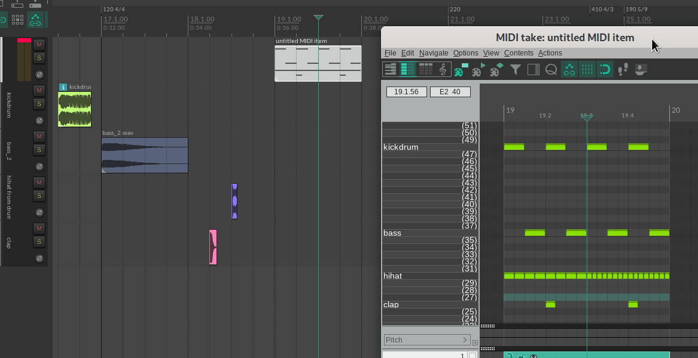

# ReaScripts
Scripts for REAPER Digital Audio Workstation, written by bfut.

Requirements: Reaper v7.xx


### Installation
Copy and paste this URL in Extensions > [ReaPack](https://github.com/cfillion/reapack) > Import repositories:

```
https://github.com/bfut/ReaScripts/raw/main/index.xml
```
Then install individual scripts in Extensions > ReaPack > Browse packages.


## Convert MIDI notes to items

* bfut_MIDI notes to items (explode note rows to subtracks).lua
* bfut_MIDI notes to items (notes to subtrack, note pitch as item pitch).lua
* bfut_MIDI notes to items (notes to subtrack, note pitch as item rate).lua
* bfut_MIDI notes to empty items (explode note rows to subtracks).lua
* bfut_MIDI notes to empty items (notes to subtrack, note pitch as item pitch).lua
* bfut_MIDI notes to empty items (notes to subtrack, note pitch as item rate).lua

Converts MIDI notes to media items in one go. Supports time signature markers.

How to set up item/sample loader:
  1. Select MIDI item(s) on one track.
  1. Select any one track with various media items.
  1. Script maps each used note row to successive media items on selected track.
  1. If there are not enough media items, script inserts empty items.

How to use:
  1. Select MIDI item(s).
  1. Select a track. (optional)
  1. Run the script.


## Step sequencer for items
* bfut_Step sequencer (copy first item on track and fill grid bar under mouse)
* bfut_Step sequencer (copy first item on track to grid bar under mouse).lua
* bfut_Remove item under mouse cursor (delete).lua

Hassle-free step sequencer for arrange view. Supports time signature markers, fixed item lanes, and free item positioning.

How to use:
  1. There should be at least one item on the track under mouse cursor. (optional)
  1. Hover mouse over track in arrange view.
  1. Run the script.

How to set up:
  1. Install the scripts.
  1. Optionally toggle ON, "Options > Trim content behind media items when editing"
  1. Works well with both, mouse modifiers and keyboard shortcuts.

Possible usage:
  - Add a source media item at the beginning of your target track.
  - Set a time selection (e.g., 16 grid bars). Hit play.
  - As you add and remove media items, REAPER's arrange view now behaves like a pattern-based step sequencer.
  - Try adjusting the grid divison.


## Copy items to project markers (propagate)
* bfut_Copy items to project markers, remove overlaps.lua
* bfut_Copy items within time selection to project markers, remove overlaps.lua

Propagates selected items to project markers. Supports time signature markers.

How to use:
  1. There must be at least one project marker.
  1. Select media item(s).
  1. Run the script.


## Copy and replace selected items
* bfut_Copy item to clipboard.lua
* bfut_Paste item from clipboard to selected items (replace).lua

Copies and replaces selected items, preserving position, length, mute status, etc. in the replaced items.

How to use:
  1. Select media item.
  1. Run script "bfut_Copy item to clipboard".
  1. Select other media item(s).
  1. Run script "bfut_Paste item from clipboard to selected items (replace)".


## Replace item under mouse cursor
* bfut_Replace item under mouse cursor with selected item.lua

Replaces item under mouse cursor with selected item, preserving position, length, mute status, etc. in the replaced item.

How to use:
  1. Select media item.
  1. Hover mouse over another item.
  1. Run the script.


## Copy and paste properties
* bfut_Copy item properties to clipboard.lua
* bfut_Paste item properties from clipboard to set selected items property (fadeinlength).lua
* bfut_Paste item properties from clipboard to set selected items property (fadeinshape).lua
* bfut_Paste item properties from clipboard to set selected items property (fadeoutlength).lua
* bfut_Paste item properties from clipboard to set selected items property (fadeoutshape).lua
* bfut_Paste item properties from clipboard to set selected items property (fixedlane).lua
* bfut_Paste item properties from clipboard to set selected items property (length).lua
* bfut_Paste item properties from clipboard to set selected items property (snapoffset).lua
* bfut_Paste item properties from clipboard to set selected items property (volume).lua
* bfut_Paste item properties from clipboard to set selected items take property (pan).lua
* bfut_Paste item properties from clipboard to set selected items take property (pitch).lua
* bfut_Paste item properties from clipboard to set selected items take property (playrate).lua
* bfut_Paste item properties from clipboard to set selected items take property (startoffset).lua
* bfut_Paste item properties from clipboard to set selected items take property (volume).lua

Copies and sets specific property in selected items. Observes item lock status.

How to use:
  1. Select media item.
  1. Run script "bfut_Copy item properties to clipboard"
  1. Select other media item(s).
  1. Run one of the scripts "bfut_Paste item properties from clipboard to set selected items ... (...)"


## other scripts
bfut_Add marker at each time signature marker.lua<br>
bfut_Add marker at each time signature marker within time selection.lua<br>
bfut_Extract loop section under mouse cursor to new item.lua<br>
bfut_Split looped item into separate items.lua<br>
bfut_Delete regions of less than 1 sample in length.lua<br>
bfut_Select items of less than 1 sample in length.lua<br>
bfut_Trim to source media lengths (limit items lengths).lua<br>
bfut_Unselect grouped items.lua<br>
bfut_Unselect ungrouped items.lua<br>
bfut_Unselect items outside time selection.lua<br>
bfut_Unselect items touching time selection.lua<br>
bfut_Unselect items within time selection.lua<br>
